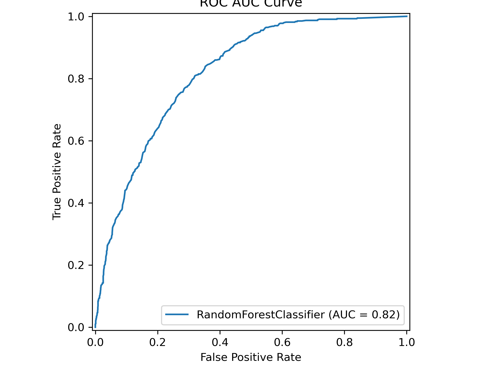
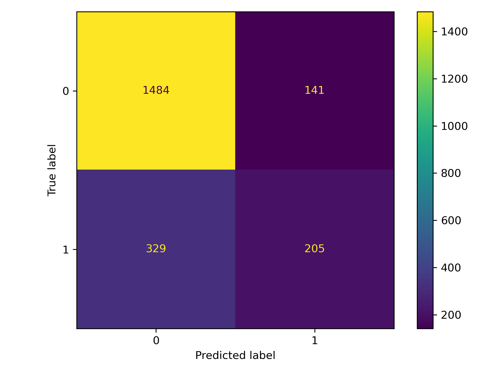
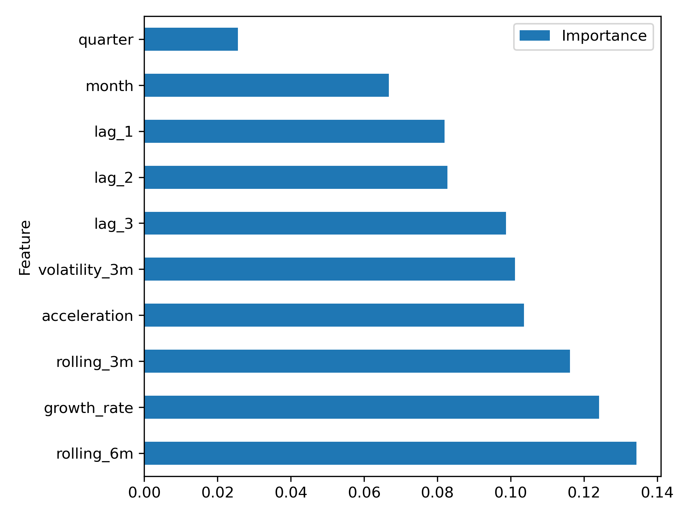

# Fashion Trend Prediction Using Machine Learning

## Project Overview

This project explores whether emerging fashion trends can be identified using historical search interest data and supervised machine learning techniques.

Fashion trend forecasting is traditionally driven by industry expertise and qualitative analysis. This project investigates whether trend momentum signals derived from Google Trends can be used to predict future trend growth and identify emerging fashion trends before they reach peak popularity.

The project follows a complete machine learning workflow including data collection, feature engineering, model development, evaluation, and interpretation.

## Key Findings

* Machine learning models successfully identified emerging fashion trends using historical search-interest data.
* Trend momentum features such as growth rate and acceleration were among the strongest predictors of future trend growth.
* Random Forest achieved the highest predictive performance and outperformed the Logistic Regression baseline.
* The results demonstrate the potential of search-behaviour analytics for supporting fashion trend forecasting and merchandising decisions.

---

## Research Question

**Can historical search interest and trend momentum metrics be used to predict emerging fashion trends?**

The objective is to build classification models capable of identifying trends that are likely to experience significant growth in the near future.

---

## Data Collection

Trend popularity data was collected using the Google Trends API via the PyTrends library.

### Data Sources

* Google Trends
* Custom fashion trend list
* Trend category mapping

Examples of fashion trends included:

* Quiet Luxury
* Coastal Cowgirl
* Balletcore
* Cargo Pants
* Wide Leg Jeans
* Eclectic Grandpa
* Sci-Fi Fits

Each trend was collected over a multi-year period and stored as monthly observations.

---

## Feature Engineering

Several time-series features were engineered to capture trend momentum and popularity patterns.

### Date Features

* Year
* Month
* Quarter

### Lag Features

* Lag 1
* Lag 2
* Lag 3

These features capture previous popularity levels.

### Trend Momentum Features

* Growth Rate
* Rolling 3-Month Average
* Rolling 6-Month Average
* Growth Acceleration

### Trend Stability Features

* 3-Month Volatility

### Category Features

Fashion trends were grouped into categories such as:

* Womenswear
* Streetwear
* Denim
* Accessories
* Footwear

---

## Target Variable

A supervised classification target was created using future trend growth.

### Future Log Growth

Future growth was calculated as:

future_log_growth = log(1 + future_score) - log(1 + current_score)

### Trend Status

A binary classification target was then created:

* 1 = Emerging Trend
* 0 = Non-Emerging Trend

This enables the prediction of whether a fashion trend is likely to experience significant future growth.

---

## Machine Learning Models

### Logistic Regression

Used as the baseline model to establish benchmark performance.

### Random Forest Classifier

Used to capture more complex non-linear relationships between trend features and future trend emergence.

---

## Model Evaluation

Models were evaluated using:

* Accuracy
* Precision
* Recall
* F1 Score
* ROC-AUC

Additional evaluation techniques included:

* Confusion Matrix
* ROC Curve Analysis
* Feature Importance Analysis
* Cross-Validation

---
## Results

### Logistic Regression

| Metric    | Score |
| --------- | ----- |
| Accuracy  | 0.75  |
| Precision | 0.44  |
| Recall    | 0.07  |
| F1 Score  | 0.13  |
| ROC-AUC   | 0.71  |

### Random Forest (RF)

| Metric    | Score |
| --------- | ----- |
| Accuracy  | 0.79  |
| Precision | 0.59  |
| Recall    | 0.38  |
| F1 Score  | 0.46  |
| ROC-AUC   | 0.82  |

### ROC Curve (RF)



### Confusion Matrix (RF)



### Feature Importance (RF)



The Random Forest model outperformed Logistic Regression across most evaluation metrics, indicating that non-linear relationships between trend momentum features and future trend growth were present in the dataset.

The strongest predictors of emerging fashion trends were growth rate, lagged popularity measures, and trend acceleration.

### Random Forest Cross Validation
* A 5-fold Group Cross-Validation strategy was employed using trend names as grouping variables to prevent data leakage between observations of the same trend. 
* The Random Forest model with GroupKFold cross validation achieved a mean ROC-AUC of 0.78 (SD = 0.03), indicating consistent predictive performance across unseen fashion trends.

---

## Project Structure

```text
├── data_collection_fashion_trends.ipynb
├── fashion_trends_ML_project.ipynb
├── trends_list.csv
├── fashion_trends_raw.csv
├── fashion_trends_combined.csv
└── README.md
```

---

## Technologies Used

### Python Libraries

* pandas
* numpy
* matplotlib
* scikit-learn
* pytrends

### Machine Learning

* Logistic Regression
* Random Forest Classification
* Cross Validation

---

## Key Learning Outcomes

This project demonstrates:

* Time-series feature engineering
* Fashion analytics applications
* Trend forecasting methodology
* Supervised machine learning
* Classification modelling
* Model evaluation and interpretation

---

## Future Improvements

Potential extensions of this project include:

* XGBoost implementation
* Hyperparameter optimisation
* Group-based cross validation using trend names
* Integration of Pinterest trend signals
* TikTok and Instagram engagement metrics
* Trend forecasting using deep learning approaches

---

## Author

Fashion Trend Prediction Project

Developed as a predictive analytics and machine learning project exploring the use of search behaviour data to identify emerging fashion trends.
